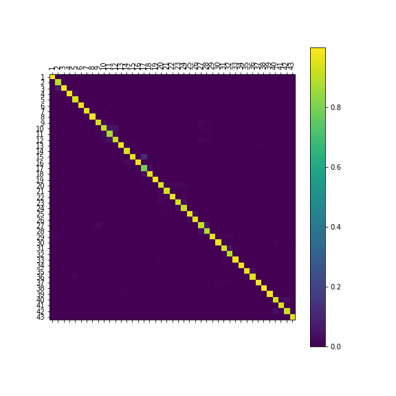

# <b>PASHETO RECOGNITION DESKTOP WITH PYQT</b>
This repository contains the desktop app with PyQT which recognizes the handwritten Pashto language characters.
## <b>Installation</b>
Use pip to install PyQt5
```bash
pip install PyQt5
```

Use pip to install numpy
```bash
pip install numpy
```

Use pip to install cv2
```bash
pip install cv2
```

Use pip to install tensorflow
```bash
pip install tensorflow
```
## <b>Model building</b>
Run pashto_recognition.ipynb. The model is saved in pashto.h5 file.
The confusion matrix is as following:


## <b>PyQT Desktop App</b>
Run pashto_ui.py using the following command.
```bash
python pashto_ui.py
```